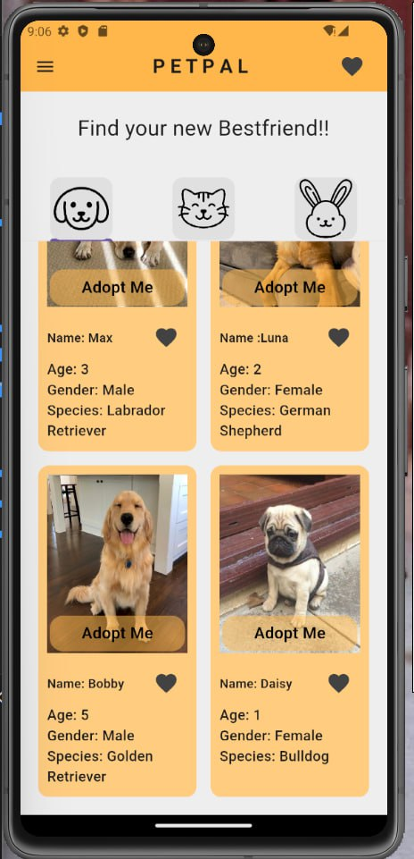

# Pet Adoption Application

This Flutter project aims to create a pet adoption application, facilitating the adoption process for both users looking to adopt pets and administrators managing pet listings. The application includes various features to enhance user experience and streamline the adoption process.

## Key Features

### Authentication
- Secure User Authentication:
  - Users must sign up or log in to access the application.
  - Authentication ensures that only registered users can view and adopt pets, while admins can manage pet listings.

### Authorization
- Role-Based Authorization:
  - The application implements role-based authorization to differentiate between regular users and administrators.
  - Admins have elevated privileges to manage pet listings, while users have access to adoption functionalities.
### User Registration
- Seamless User Registration:
  - New users can easily sign up for an account within the application.
  - User registration enables personalized experiences and allows users to manage their adoption requests.

### Role Assignment
- Admin and User Roles:
  - Upon registration, users are assigned roles - either regular user or admin.
  - Admins have additional capabilities for managing pet listings.

### Feature 1: Pet Adoption Application management
   - Users can browse through available pets for adoption.
  - Adoption listings include details such as pet breed, age, and images of the pets.
  - Users can submit adoption requests for pets they are interested in.
  - It enables users to create, view, update and delete adoption applications.
### Feature 2: Pet Listing Management
- Pet Management:
  - Admins can add new pet listings to the application.
  - Admins can edit existing pet information, including descriptions and images.
  - Admins have the ability to remove pet listings from the application.

## Additional Flutter Features

- Cross-Platform Compatibility:
  - The application is built using Flutter to ensure compatibility across both Android and iOS platforms.

- Intuitive User Interface:
  - Flutter's widget-based architecture allows for an intuitive and engaging user interface, enhancing the overall user experience.
## Database Choice

For this Flutter project, I utilized MongoDB as a database due to its scalability, flexibility, and ease of integration with Flutter applications.
## Screenshots

